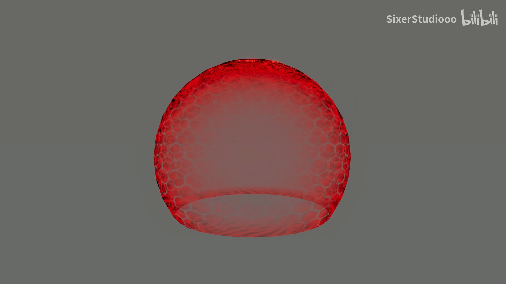
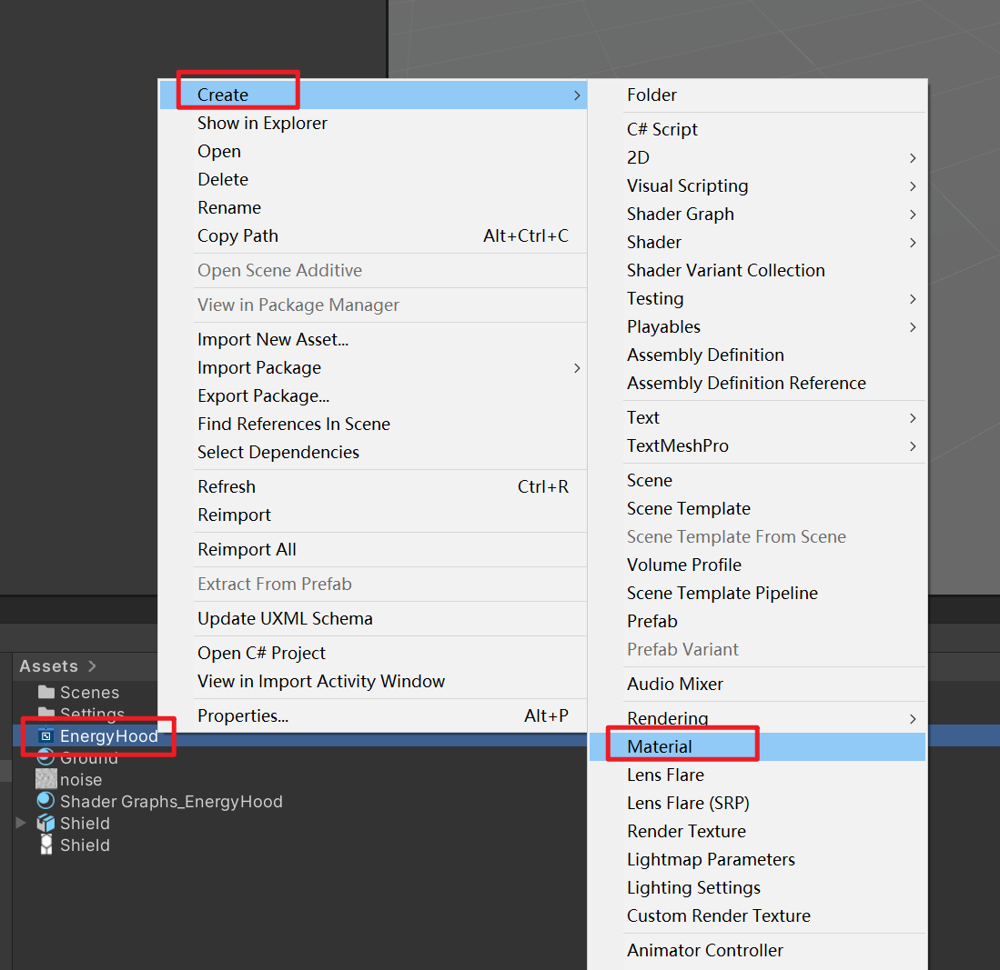
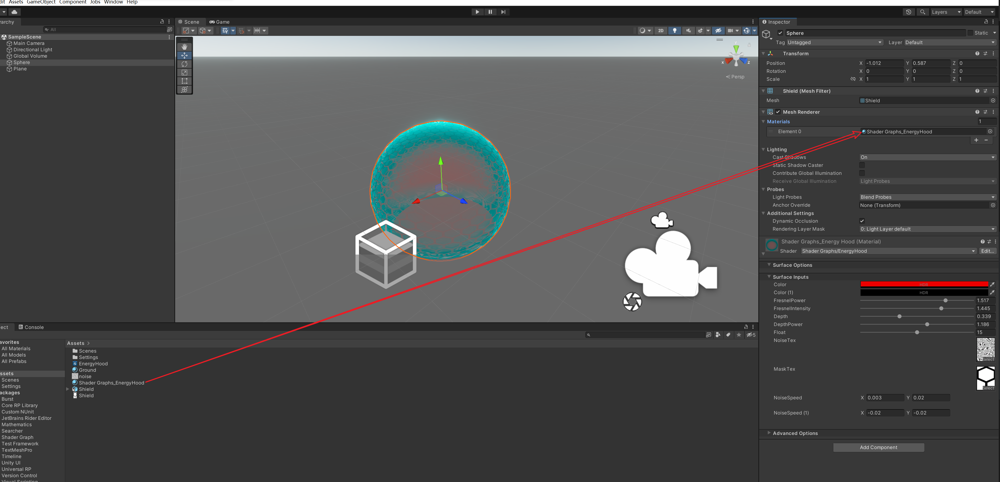

# EnergyHoodShader
能量罩着色器(EnergyHoodShader)

## 前言
看到群友发了一个,用连连看搞了一个玩玩，就当做练习了~

## 使用版本
Unity : 2021.3.19f1

URP : 12.1.10

Shader Graph : 12.1.10

## 效果
视频:  https://www.bilibili.com/video/BV1dr4y1X7ep/?share_source=copy_web&vd_source=4870d5af44bf31a98d7625c63e505a16

## 使用
右键Shader创建材质

将材质拖入GameObjcet的Mesh Renderer组件中

调整参数和上Noise图和Mask图开始愉快的玩耍吧~

## 如果遇到问题欢迎联系我~
B站：https://space.bilibili.com/281134623?spm_id_from=333.788.0.0

QQ : 478385373

邮箱：478385373@qq.com